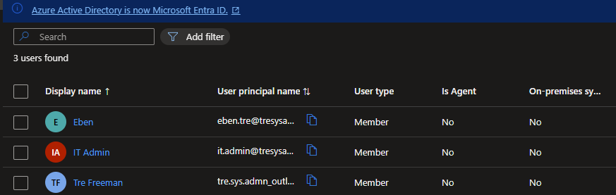
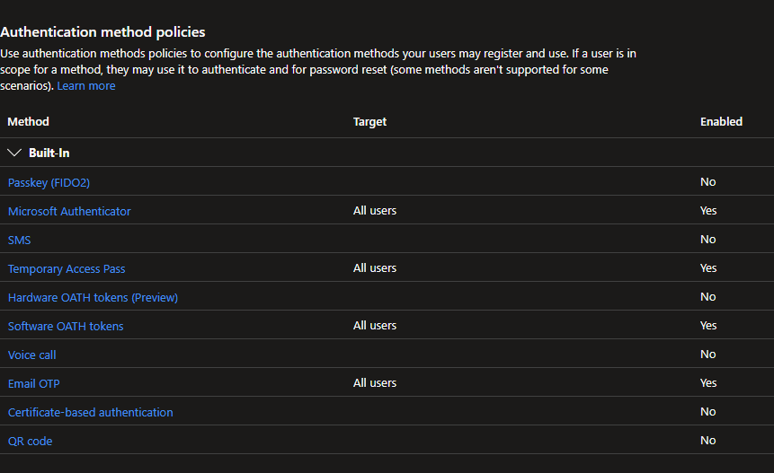

# 🔐 Entra ID Identity & Access Management Lab

## 📌 Project Overview

This lab demonstrates hands-on experience with cloud identity management using Microsoft Entra ID.

The environment simulates enterprise identity administration tasks including role-based access control, multi-factor authentication, conditional access policies, and self-service password reset.

---

# 🧰 Technologies Used

* Microsoft Entra ID
* Microsoft 365 Tenant
* Conditional Access Policies
* Multi-Factor Authentication (MFA)

---

# 🧑‍💼 Identity Structure

Users and groups were created to simulate a corporate environment.

## Security Groups

* HR
* IT
* Finance

These groups are used to control access and apply policies.

---

# 🔐 Role-Based Access Control (RBAC)

An administrative user was created and assigned elevated privileges.

## Configuration

* Created user: it.admin
* Assigned role: User Administrator

## Outcome

* User can manage users and groups
* Limited access to other administrative functions

---

# 🔒 Multi-Factor Authentication (MFA)

A Conditional Access policy was created to enforce MFA.

## Policy Configuration

Name: Require MFA for Admins

Assignments:

* Applied to IT group

Access Controls:

* Grant access only if MFA is completed

## Outcome

Administrative users must verify identity using MFA before accessing resources.

---

# 🌍 Location-Based Access Control

Conditional Access policy was created to restrict login locations (Named Locations/IP).

## Policy Configuration

Name: Block Non-Ghana Logins

Assignments:

* Applied to all users

Conditions:

* Allow access only from Ghana

Access Controls:

* Block access outside allowed location

## Outcome

Unauthorized login attempts from outside Ghana are blocked.

---

# 👥 Group-Based Access Control

Access is assigned using security groups instead of individual users.

## Implementation

* Resources assigned to HR, IT, Finance groups
* Users inherit access based on group membership

## Outcome

* Simplified access management
* Scalable permission model

---

# 🔁 Self-Service Password Reset (SSPR)

Enabled self-service password reset for users.

## Configuration

* Enabled for selected users
* Authentication methods:

  * Email
  * Phone

## Outcome

Users can reset passwords without IT support.

---

# 📸 Screenshots

## Entra ID Users & Groups

## Conditional Access Policy (MFA)

---

# 🎯 Learning Outcomes

This lab demonstrates practical skills in:

* Identity and Access Management (IAM)
* Role-Based Access Control (RBAC)
* Conditional Access Policies
* Multi-Factor Authentication
* Cloud Security Enforcement

---

# 🚀 Next Steps

* Integrate with on-prem Active Directory (Hybrid Identity)
* Enroll devices into Intune
* Apply device compliance policies
* Implement application access control

---

# 👤 Author

Tre
Cloud Identity & Security Lab
